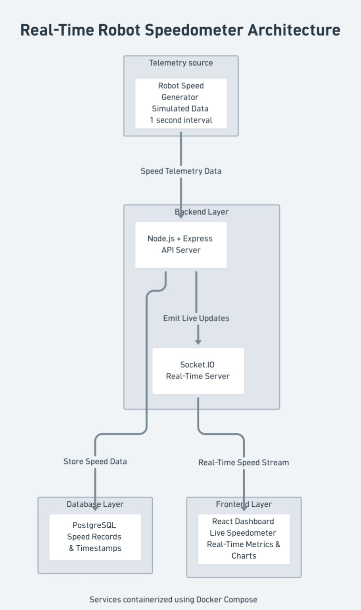

# Real-Time Robot Speedometer Dashboard

A full-stack real-time telemetry dashboard simulating warehouse robot speed monitoring using React, Node.js, PostgreSQL, Socket.IO and Docker.

---

# Features

- Real-time robot speed monitoring
- Analog and digital speedometer modes
- Live telemetry updates using Socket.IO
- PostgreSQL data persistence
- Real-time metrics dashboard
- Live speed trend visualization
- Docker containerization
- Responsive modern UI

---

# Tech Stack

## Frontend
- React
- Vite
- JavaScript

## Backend
- Node.js
- Express.js
- Socket.IO

## Database
- PostgreSQL

## DevOps
- Docker
- Docker Compose

---

# Architecture Diagram



---

# System Flow

1. Simulated robot telemetry data is generated every second
2. Backend API receives telemetry speed data
3. Speed records are stored in PostgreSQL
4. Socket.IO emits live updates to frontend
5. React dashboard displays real-time speed and metrics

---

# Project Structure

```txt
unbox_speedometer_app/
│
├── frontend/
├── backend/
├── docker-compose.yml
├── architecturediagram.jpeg
└── README.md