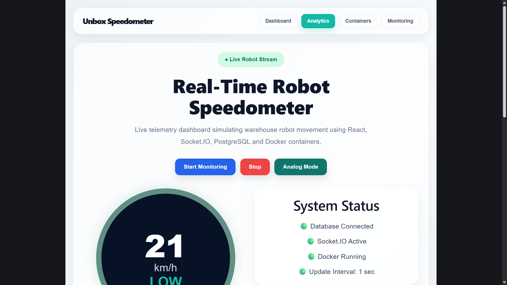
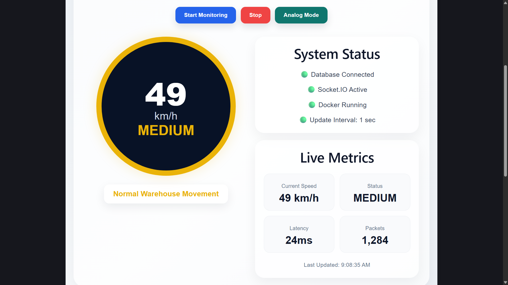
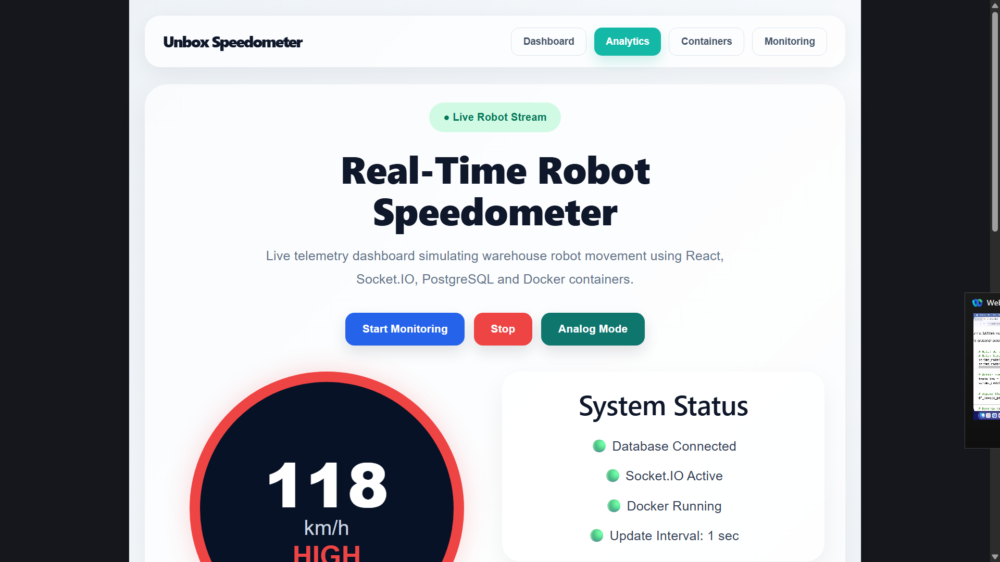
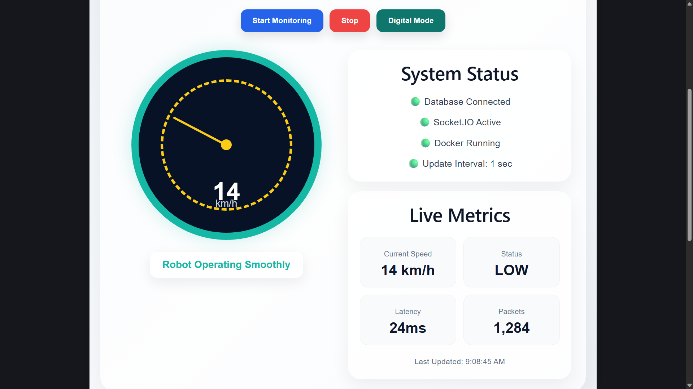
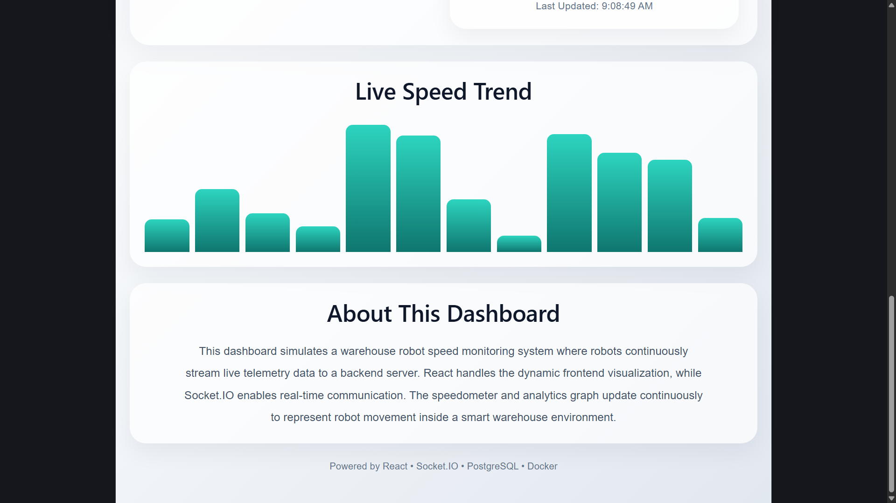

# Real-Time Robot Speedometer Dashboard

A full-stack real-time telemetry dashboard simulating warehouse robot speed monitoring using **React, Node.js, PostgreSQL, Socket.IO, Docker, Render and Vercel**.

The application continuously generates robot speed telemetry data every second, stores it inside PostgreSQL, and streams live updates to the frontend using Socket.IO.

---

# Live Demo

## Frontend

https://real-time-robot-speedometer.vercel.app

## Backend

https://real-time-robot-speedometer.onrender.com

---

# Features

* Real-time robot speed monitoring
* Live telemetry streaming using Socket.IO
* Analog and digital speedometer modes
* Dynamic LOW / MEDIUM / HIGH robot status
* PostgreSQL database integration
* Live speed trend analytics
* Responsive modern UI
* Dockerized full-stack application
* Real-time frontend updates every second

---

# Tech Stack

## Frontend

* React
* Vite
* JavaScript

## Backend

* Node.js
* Express.js
* Socket.IO

## Database

* PostgreSQL (NeonDB)

## DevOps & Deployment

* Docker
* Docker Compose
* Render
* Vercel

---

# Architecture Diagram


---

# Screenshots

## Dashboard - Low Speed



## Medium Speed Status



## High Speed Status



## Analog Mode



## Analytics Section



---

# System Flow

1. Robot telemetry speed data is simulated every second
2. Backend server receives telemetry data
3. Speed records are stored in PostgreSQL
4. Socket.IO broadcasts live updates
5. React frontend receives updates instantly
6. Dashboard visualizes live robot movement data

---

# Project Structure

```txt
unbox_speedometer_app/
│
├── frontend/
│   ├── src/
│   ├── public/
│   └── package.json
│
├── backend/
│   ├── server.js
│   ├── db.js
│   └── package.json
│
├── Screenshots/
├── docker-compose.yml
├── architecture-diagram.jpeg
└── README.md
```

---

# Installation & Setup

## Clone Repository

```bash
git clone https://github.com/YOUR_USERNAME/YOUR_REPOSITORY.git
cd unbox_speedometer_app
```

---

# Frontend Setup

```bash
cd frontend
npm install
npm run dev
```

---

# Backend Setup

```bash
cd backend
npm install
node server.js
```

---

# PostgreSQL Table Setup

Run the following SQL query inside PostgreSQL:

```sql
CREATE TABLE speed_data (
  id SERIAL PRIMARY KEY,
  speed INTEGER,
  created_at TIMESTAMP DEFAULT CURRENT_TIMESTAMP
);
```

---

# Run Using Docker

```bash
docker-compose up --build
```

---

# Deployment

## Frontend Deployment

* Vercel

## Backend Deployment

* Render

## Database

* Neon PostgreSQL

---

# Key Learnings

* Real-time communication using Socket.IO
* Handling production CORS issues
* PostgreSQL integration with Node.js
* Deployment debugging on Render and Vercel
* Docker containerization
* Managing live telemetry data streams

---

# Future Improvements

* Real warehouse robot integration
* Authentication system
* Historical telemetry analytics
* WebSocket reconnection handling
* Advanced monitoring dashboard

---

# Author

Anushka Jamkar
